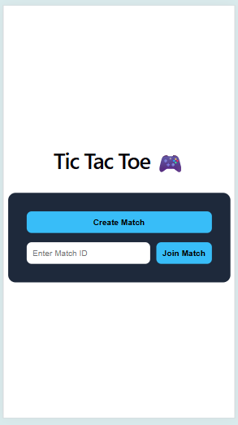
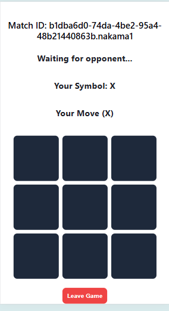
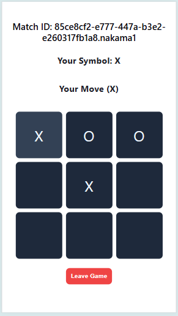

# Multiplayer Tic Tac Toe (Nakama)

## 🚀 Overview
This project is a real-time multiplayer Tic Tac Toe game built using a **server-authoritative architecture** with Nakama.

The backend validates all game actions to prevent cheating and ensures consistent game state across all connected clients.

---

## 🌐 Live Links

- **Frontend (Play Here):**  
  https://tictactoe-nakama-jade.vercel.app

- **Backend (Nakama Server):**  
  https://lila.virelo.in

## 🧠 Architecture

```text
Client (React)
   ↓ WebSocket
Nakama Server (Authoritative)
   ↓
Match Loop (Game Logic)
   ↓
Broadcast State Updates
````

### Key Design Principles:

* Server-authoritative game logic
* Stateless clients (UI only)
* Real-time synchronization via WebSockets
* Deterministic game state updates

---

## 📸 Demo


### Mobile


## ⚙️ Tech Stack

### Frontend

* React + TypeScript
* WebSocket (Nakama JS Client)
* Vercel (Deployment)

### Backend

* Nakama (JavaScript Runtime)
* Docker + Docker Compose
* AWS EC2 (Hosting)
* Nginx (HTTPS)

---

## 🎮 Features

### Core Features

* Real-time multiplayer gameplay
* Server-side move validation
* Automatic matchmaking system
* Game state synchronization
* Player turn enforcement

### Edge Case Handling

* Prevent invalid moves
* Handle duplicate joins
* Detect player disconnects
* Declare winner on opponent leave
* Graceful match termination

---

## 🔄 Game Flow

1. Player creates or joins a match
2. Nakama pairs players automatically
3. Game state is managed on server
4. Moves are validated in `matchLoop`
5. State updates are broadcast to all players
6. Winner is determined and displayed

---

## 🧪 How to Test

1. Open the app in two browser tabs
2. Click **Create Match**
3. Second player joins automatically
4. Play the game
5. Test edge cases:

   * Leave mid-game
   * Invalid moves
   * Full game completion

---

## 🛠️ Local Setup

### Backend

```bash
cd backend
docker-compose up
```

### Frontend

```bash
cd client
npm install
npm run dev
```

---

## 🚀 Deployment

### Backend

* Hosted on AWS EC2
* Dockerized Nakama server
* HTTPS via Nginx

### Frontend

* Deployed on Vercel

---

## 🧩 Key Implementation Details

### Server-Authoritative Logic

* All moves validated in backend (`matchLoop`)
* Prevents client-side manipulation
* Ensures fair gameplay

### Real-Time Sync

* Uses WebSockets via Nakama
* Broadcasts state changes to all players

### Matchmaking Strategy

- Implemented a simple 2-player matchmaking system
- Server checks for existing matches with one waiting player
- If found, the player is added to that match
- Otherwise, a new match is created and the player waits for an opponent
- Ensures all matches are strictly limited to 2 players

### Match Lifecycle Handling

* Handles joins and leaves correctly
* Terminates match when no players remain
* Ensures proper cleanup of stale matches

---

## ⚡ Design Decisions

* Focused on correctness over feature bloat
* Avoided unnecessary persistence (stateless matches)
* Prioritized real-time consistency and reliability
* Clean separation between UI and game logic

---

## 🔮 Future Improvements

* Leaderboard with persistent storage
* Reconnect support for dropped sessions
* Timer-based gameplay mode
* Match history tracking
* UI/UX enhancements

---

## 👤 Author

**K B Pramod**
* GitHub: [https://github.com/kbpramod](https://github.com/kbpramod)

---

## 💯 Notes

This project focuses on:

* Real-time multiplayer synchronization
* Server-authoritative backend design
* Handling edge cases in distributed systems

The implementation prioritizes robustness and correctness, which are critical for multiplayer systems.

